# Advanced RAG Pipeline with ChromaDB and Groq

An end-to-end Retrieval-Augmented Generation (RAG) pipeline that loads PDF documents, creates semantic embeddings, stores them in ChromaDB, retrieves relevant passages, and generates grounded answers using a Groq-hosted large language model.

## Features

- Recursively loads PDFs from a local directory
- Preserves source filename and page metadata
- Splits documents into overlapping text chunks
- Generates embeddings with Sentence Transformers
- Persists document embeddings in ChromaDB
- Performs semantic similarity search
- Filters retrieval by source filename, distance, or similarity score
- Generates answers using a Groq LLM
- Returns source citations, previews, and retrieval confidence
- Supports optional answer summarization
- Maintains in-memory query history
- Includes a simulated streaming demonstration

## Architecture

```mermaid
flowchart TD
    A[PDF documents] --> B[Load PDF pages]
    B --> C[Split text into chunks]
    C --> D[Generate embeddings]
    D --> E[(ChromaDB)]
    F[User question] --> G[Generate query embedding]
    G --> E
    E --> H[Retrieve relevant chunks]
    H --> I[Build grounded prompt]
    I --> J[Groq LLM]
    J --> K[Answer with citations]
```



## Technology Stack

- Python 3.10+
- Jupyter Notebook
- LangChain
- Sentence Transformers
- ChromaDB
- Groq API
- PyPDF
- NumPy
- scikit-learn

## Project Structure

```text
advanced-rag-pipeline/
├── rag.ipynb
├── data/
│   ├── your-document.pdf
│   └── vector_store/
├── .env
├── .gitignore
├── requirements.txt
└── README.md
```

The `data/vector_store` directory is created automatically when ChromaDB is initialized.

## Prerequisites

- Python 3.10 or later
- Jupyter Notebook or JupyterLab
- A Groq API key
- One or more PDF documents

## Installation

### 1. Clone the repository

```bash
git clone https://github.com/Samyoghsonu/Advanced-Rag-Pipeline.git
cd Advanced-Rag-Pipeline
```

### 2. Create a virtual environment

Using `uv`:

```bash
uv venv
```

Activate it on Windows PowerShell:

```powershell
.venv\Scripts\Activate.ps1
```

Activate it on macOS or Linux:

```bash
source .venv/bin/activate
```

Alternatively, create a standard Python virtual environment:

```bash
python -m venv .venv
```

### 3. Install the dependencies

Using `uv`:

```bash
uv pip install jupyter langchain langchain-community langchain-text-splitters langchain-core langchain-groq sentence-transformers chromadb pypdf pymupdf python-dotenv numpy scikit-learn
```

Using `pip`:

```bash
pip install jupyter langchain langchain-community langchain-text-splitters langchain-core langchain-groq sentence-transformers chromadb pypdf pymupdf python-dotenv numpy scikit-learn
```

Suggested `requirements.txt`:

```text
jupyter
langchain
langchain-community
langchain-text-splitters
langchain-core
langchain-groq
sentence-transformers
chromadb
pypdf
pymupdf
python-dotenv
numpy
scikit-learn
```

Install from the file with:

```bash
pip install -r requirements.txt
```

## Environment Configuration

Create a `.env` file in the project root:

```env
GROQ_API_KEY=your_groq_api_key
```

Never commit this file or expose the API key publicly.

## Adding PDF Documents

Create a `data` directory and place your PDFs inside it:

```text
data/
├── document-one.pdf
├── document-two.pdf
└── reports/
    └── document-three.pdf
```

The loader searches recursively, so PDFs inside nested directories are also processed.

## Running the Project

Start Jupyter Notebook:

```bash
jupyter notebook
```

Open `rag.ipynb` and run the cells from top to bottom.

The notebook performs these stages:

1. Loads PDF documents from `./data`
2. Extracts their content page by page
3. Splits the content into overlapping chunks
4. Generates embeddings using `all-MiniLM-L6-v2`
5. Stores the embeddings in ChromaDB
6. Retrieves relevant chunks for a question
7. Sends the question and context to the Groq LLM
8. Returns a grounded answer with optional citations and summarization

## Document Chunking

The default chunking configuration is:

```python
chunk_size = 1000
chunk_overlap = 200
```

You can customize it as follows:

```python
chunks = split_documents(
    all_pdf_documents,
    chunk_size=800,
    chunk_overlap=150,
)
```

Smaller chunks can improve retrieval precision, while larger chunks provide more surrounding context.

## Embedding Model

The default embedding model is `all-MiniLM-L6-v2`:

```python
embedding_manager = EmbeddingManager()
```

You can select another Sentence Transformer model:

```python
embedding_manager = EmbeddingManager(
    model_name="all-mpnet-base-v2"
)
```

The same embedding model must be used for both document indexing and user queries.

## Vector Database

Embeddings are stored in a persistent ChromaDB collection:

```python
vectorstore = VectorStore(
    collection_name="pdf_documents",
    persist_directory="./data/vector_store",
)
```

The indexed data remains available after the notebook is restarted.

## Semantic Retrieval

Retrieve the most relevant chunks:

```python
results = rag_retriever.retrieve(
    "Which states had the highest and lowest poverty rates in 2022?",
    top_k=5,
)
```

### Filter by source file

```python
results = rag_retriever.retrieve(
    "What are the candidate's education details?",
    top_k=3,
    source_file="resume.pdf",
)
```

### Filter by similarity score

```python
results = rag_retriever.retrieve(
    "Explain the attention mechanism",
    top_k=5,
    score_threshold=0.2,
)
```

### Filter by maximum distance

```python
results = rag_retriever.retrieve(
    "Explain the report findings",
    top_k=5,
    max_distance=1.2,
)
```

ChromaDB's default L2 distance is lower for more relevant results. The notebook converts it into a bounded similarity score:

```python
similarity_score = 1.0 / (1.0 + distance)
```

This score is a retrieval-ranking heuristic, not a calibrated probability.

## Simple RAG Pipeline

The `rag_simple` function combines retrieval with answer generation:

```python
answer = rag_simple(
    query="What does the report say about poverty rates?",
    retriever=rag_retriever,
    llm=llm,
    top_k=3,
)

print(answer)
```

It performs the following operations:

1. Embeds the user question
2. Retrieves the most relevant chunks
3. Combines the chunks into a context
4. Sends the context and question to the Groq model
5. Returns the generated answer

## Enhanced RAG Pipeline

The `rag_advanced` function returns additional retrieval details:

```python
result = rag_advanced(
    query="What does the Gini index measure?",
    retriever=rag_retriever,
    llm=llm,
    top_k=3,
    min_score=0.1,
    return_context=True,
)

print("Answer:", result["answer"])
print("Sources:", result["sources"])
print("Confidence:", result["confidence"])
print("Context:", result["context"])
```

Example output structure:

```python
{
    "answer": "Generated answer based on retrieved context.",
    "sources": [
        {
            "source": "income-report.pdf",
            "page": 4,
            "score": 0.58,
            "preview": "Retrieved passage preview..."
        }
    ],
    "confidence": 0.58,
    "context": "Combined retrieved document content..."
}
```

## Advanced Pipeline Class

`AdvancedRAGPipeline` adds source citations, previews, optional summarization, query history, and simulated streaming:

```python
advanced_rag = AdvancedRAGPipeline(
    rag_retriever,
    llm,
)

result = advanced_rag.query(
    question="What is attention in transformer models?",
    top_k=3,
    min_score=0.1,
    stream=True,
    summarize=True,
)

print("Answer:", result["answer"])
print("Summary:", result["summary"])
print("Sources:", result["sources"])
```

> The current streaming option prints the prepared prompt progressively. It does not stream generated response tokens from the Groq API.

## LLM Configuration

The default Groq model is `llama-3.1-8b-instant`:

```python
llm = ChatGroq(
    groq_api_key=groq_api_key,
    model_name="llama-3.1-8b-instant",
    temperature=0.1,
    max_tokens=1024,
)
```

A low temperature is used to produce more consistent, context-grounded answers.

## Important Notes

### Duplicate documents

Running the ingestion cells repeatedly adds duplicate records because every chunk receives a randomly generated UUID.

To avoid duplicates, you can:

- Clear the existing collection before re-indexing
- Generate deterministic IDs from the filename, page, and chunk index
- Check whether a document has already been indexed

### Changing the embedding model

If you change the embedding model, clear or recreate the ChromaDB collection before indexing again. Embeddings produced by different models should not be mixed in one collection.

### Answer accuracy

Generated-answer quality depends on:

- PDF extraction quality
- Chunk size and overlap
- Embedding-model quality
- Retrieval thresholds
- Number of retrieved chunks
- Whether the required information exists in the documents

## Recommended `.gitignore`

If you do not want to upload PDFs, secrets, virtual environments, or the generated vector database to GitHub, use:

```gitignore
# Environment variables
.env
.env.*

# Virtual environments
.venv/
venv/
env/

# Python
__pycache__/
*.py[cod]
.ipynb_checkpoints/

# PDF documents and generated vector data
data/
*.pdf

# Editor and operating-system files
.vscode/
.idea/
.DS_Store
Thumbs.db
```

To preserve an empty `data` directory in GitHub, add `data/.gitkeep` and replace `data/` in `.gitignore` with:

```gitignore
data/*
!data/.gitkeep
```

## Troubleshooting

### `GROQ_API_KEY` is missing

Ensure the `.env` file exists in the project root:

```env
GROQ_API_KEY=your_actual_api_key
```

Restart the notebook kernel after modifying environment variables.

### No PDF files found

Confirm that your PDF files are stored inside `./data` and their filenames end with `.pdf`.

### No relevant context found

Try one or more of the following:

- Increase `top_k`
- Reduce `score_threshold`
- Remove the `source_file` filter
- Ask a more specific question
- Verify that the PDF contains the requested information

### Unexpected or duplicate search results

Delete the generated `data/vector_store` directory or select a new collection name, then rerun the indexing cells.

### Incomplete PDF extraction

Some PDFs contain scanned images rather than selectable text. These files require OCR before they can be searched effectively.

## Future Improvements

- Deterministic IDs and duplicate detection
- Batch-based ChromaDB ingestion
- True Groq response-token streaming
- Hybrid keyword and vector search
- Richer metadata filtering
- Cross-encoder reranking
- Conversation-aware query rewriting
- Automated RAG evaluation
- OCR support for scanned PDFs
- FastAPI or Streamlit interface
- Docker-based deployment

## Security

- Never commit `.env` or API keys
- Do not commit confidential PDF documents
- Do not commit a vector database containing sensitive content
- Review retrieved context before using private documents
- Add authentication and access controls before deployment

## License

This project is intended for educational and development purposes. Add an appropriate open-source license before distributing or using it in production.

## Author

**Samyogh Chilivery**

AI Engineer focused on Full-Stack Generative AI systems, RAG, LangChain/LangGraph, Agentic AI, Machine Learning, and Deep Learning.
